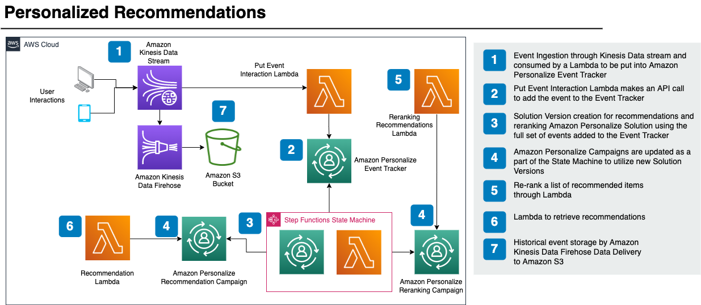
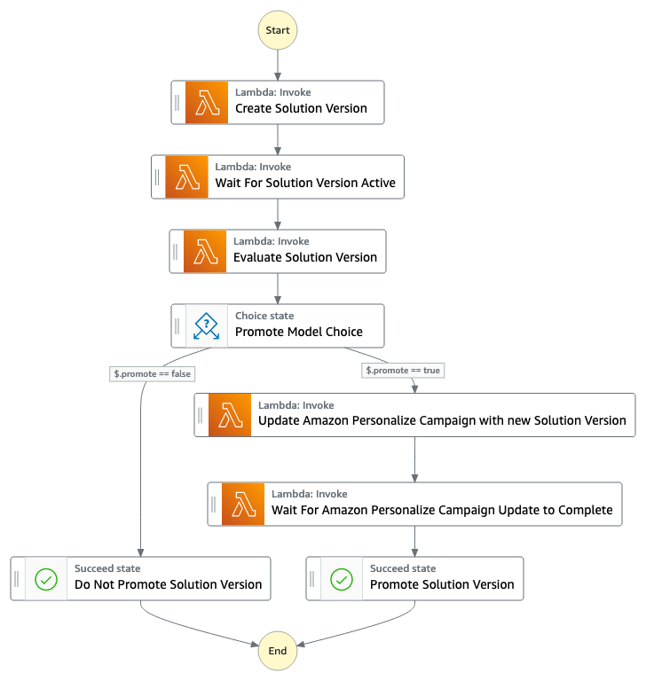

# Animal Recommender

This solution implements the providing of recommendations and re-ranking of recommendations of adoptable pets for adopters.
The Amazon Personalize recommendation and re-ranking models work by observing a sequence of user-item interactions and anticipating the next items a user would like to interact with.  The more of these interactions the model has for a given user, the better the recommendation will be.  


This sample code sets up a pipeline for real time data ingestion into Amazon Personalize to allow serving personalized recommendations to your users. The pipeline takes in user interaction data (e.g., visited pets) and automatically updates the recommendations in Amazon Personalize. The interaction tracking is done via Amazon Kinesis and AWS Lambda, and the recommendations and re-ranking is done via Lambda. Additionally, the ingested data is used for providing a history per user that can be queried, and storage of the raw interaction data in Amazon Simple Storage Service (Amazon S3).


As new users are added and create events, solution versions will need to be created and campaigns will need to be updated to utilize the new models (solution versions). This is accomplished through the following AWS Step Functions state machine:


This state machine is triggered on a time based rule set to once a day. The state machine will generate new solution versions for recommendation and reranking models if they pass the evaluation threshold set in the config/{env}.yml

## Setup

To manually create a virtualenv on MacOS and Linux:

```
$ python3 -m venv .venv
```

After the init process completes and the virtualenv is created, you can use the following
step to activate your virtualenv.

```
$ source .venv/bin/activate
```

If you are a Windows platform, you would activate the virtualenv like this:

```
% .venv\Scripts\activate.bat
```

Once the virtualenv is activated, you can install the required dependencies.

```
$ pip install -r requirements.txt
```

At this point you can now synthesize the AWS CloudFormation template for this code.

```

$ export ACCOUNT_ID=123456789
$ export CDK_DEPLOY_REGION=us-east-1
$ export CDK_ENVIRONMENT=dev
$ cdk synth
```

## To Deploy
Bitbucket and gitlab pipelines have been provided as an example.
Requirements:
- python3.9
- cdk 2.23.0 or higher
- aws cli credentials configured
environment variables set:
```
export ACCOUNT_ID=123456789
export CDK_DEPLOY_REGION=us-east-1
export CDK_ENVIRONMENT=dev
```
CDK_ENVIRONMENT refers the config/{env}.yml file
Update ```vpcId``` in config/{env}.yml to match your vpcId.
to deploy execute the following:
```
./deploy.sh
```
This will install the required python dependencies. After installing dependencies it runs a python script that creates an s3 bucket, a kms key and adds the seed data for the initial model creations.
Afterwards it will run ```cdk deploy``` to create the remaining infrastructure.

## Infrastructure:

### S3 Bucket:

Recommender stack deploys an S3 bucket where raw kinesis events are stored.

Prior to stack creation a script creates a seed bucket with the following name {env}-recommender-seed-data-bucket-s3b. Seed data is pushed here in the pipeline. The seed data is used to create the initial solution versions for the recommender campaign and the reranking campaign.

### Personalize Native Cloudformation Resources:

- Interactions schema: stores historical and real-time data from interactions between users and items in your catalog
- Items schema: stores metadata about your items in your catalogue like animal breed, age, size Dataset group: a container for Amazon Personalize components and custom resources, including datasets, event trackers, solutions, filters, campaigns, and batch inference jobs
- Iteractions Dataset, Items Dataset: containers for data, located in s3 seed bucket
- Solution: combination of an Amazon Personalize recipe and customized parameters
- One solution exists for reranking and for recommendations, they are both associated to the same dataset group

### Personalize Custom Resources:

#### Recommender:
With Amazon Personalize Custom dataset groups, you can get recommendations in real-time. For real-time recommendations, you must create a campaign before you get recommendations.

- Solution Version: trained machine learning model you can deploy to get recommendations for customers
- Event Tracker: specifies a destination dataset group for new event data, used for when calling put_events
- Campaign:  a deployed solution version with provisioned dedicated transaction capacity for creating real-time recommendations, used when calling get_recommendations. Waits for solution version to be ready, creates campaign using solution version. When campaign is ready, it issues callback to wait condition to signal Cloudformation that the resources have been created successfully.

#### Reranker:
The Personalized-Ranking recipe generates personalized rankings of items. A personalized ranking is a list of recommended items that are re-ranked for a specific user. This is useful if you have a collection of ordered items, such as search results, promotions, or curated lists, and you want to provide a personalized re-ranking for each of your users. 

- Reranking Solution Version: trained machine learning model you can deploy to get rankings for specific users
- Reranking Campaign:  a deployed solution version with dedicated transaction capacity for creating real-time rerankings, used when calling get_reranking. This custom resource is Codebuild backed.  The codebuild job waits for the solution version to be ready and creates a campaign using the new solution version. When campaign is ready, it issues callback to wait condition to signal cloudformation that the resources have been created successfully. The initial model is trained using the seed data that is added to the Personalize datasets from the s3 seed bucket.

### Notifications:

The stack creates an sns topic in each environment, which sends emails based on events in the state machine like model promotion and state machine failures.

### Lambdas:
#### Recommendation Lambda: 
To retrieve recommendations you would submit a request to the recommendation lambda with a payload in the following format:
```
{
  "userId": "3578196281679609099",
  "limit": 6
}
```
An example response will contain a list of animal groups:
```
[{"id": "1-domestic short hair-1-1"},
{"id": "1-domestic short hair-3-3"},
{"id": "1-domestic short hair-3-2"},
{"id": "1-domestic short hair-1-2"},
{"id": "1-domestic short hair-3-1"},
{"id": "2-beagle-3-3"},
```
If you leave out the userId field, the solution will provide general recommendations.

#### Re-ranking Lambda: 
To get re-ranking you would submit a request to the re-ranking lambda.
The payload contains the user id of all the item ids to be re-ranked, along with their metadata. 
In our example data we use the Oxford Pets classes for animal_species_id (1=cat, 2=dog) and integers 1-5 for animal_age_id and animal_size_id
Example:
```
{
   "userId":"12345",
   "itemMetadataList":[
      {
         "itemId":"1",
         "animalMetadata":{
            "animal_species_id":"2",
            "animal_primary_breed_id":"Saint_Bernard",
            "animal_size_id":"3",
            "animal_age_id":"2"
         }
      },
      {
         "itemId":"2",
         "animalMetadata":{
            "animal_species_id":"1",
            "animal_primary_breed_id":"Egyptian_Mau",
            "animal_size_id":"1",
            "animal_age_id":"1"
         }
      },
      {
         "itemId":"3",
         "animalMetadata":{
            "animal_species_id":"2",
            "animal_primary_breed_id":"Saint_Bernard",
            "animal_size_id":"3",
            "animal_age_id":"2"
         }
      }
   ]
}
```
The Lambda then re-ranks these items and returns an ordered list with the item ids, along with the direct response from personalize which is a ranked list of the animal groups that the items are in along with their score.  With the User-Personalization and Personalized-Ranking recipes, Amazon Personalize includes a score for each item in recommendations. These scores represent the relative certainty that Amazon Personalize has in which item the user will select next. Higher scores represent greater certainty. 
```
{
   "ranking":[
      "1",
      "3",
      "2"
   ],
   "personalizeResponse":{
      "ResponseMetadata":{
         "RequestId":"a2ec0417-9dcd-4986-8341-a3b3d26cd694",
         "HTTPStatusCode":200,
         "HTTPHeaders":{
            "date":"Thu, 16 Jun 2022 22:23:33 GMT",
            "content-type":"application/json",
            "content-length":"243",
            "connection":"keep-alive",
            "x-amzn-requestid":"a2ec0417-9dcd-4986-8341-a3b3d26cd694"
         },
         "RetryAttempts":0
      },
      "personalizedRanking":[
         {
            "itemId":"2-Saint_Bernard-3-2",
            "score":0.8947961
         },
         {
            "itemId":"1-Siamese-1-1",
            "score":0.105204
         }
      ],
      "recommendationId":"RID-d97c7a87-bd4e-47b5-a89b-ac1d19386aec"
   }
}
```
### State Machine:

The state machine is made up of Lambda functions.
For each execution of the state machine a new solution version is trained. If the solution version model passes the evaluation criteria, the campaign is updated with the new solution version.

### Kinesis:

A Kinesis Stream is created which consumes events for personalize. Records from Kinesis are consumed by the put events Lambda which adds the events to the personalize event tracker. Kinesis firehose also stores the same raw events in s3.

Note: If your function can't scale up to handle the total number of concurrent batches, you can reserve concurrency for the put event lambda by adding the property `reserved_concurrent_executions` to `put_events_lambda`. See the official [Using AWS Lambda with Amazon Kinesis documentation](https://docs.aws.amazon.com/lambda/latest/dg/with-kinesis.html) for more details.

The payload to send to kinesis has the following format, for an unauthenticated user the "userId" field is removed
```
{
    "Partitionkey": "randomstring",
    "Data": {
        "userId": "12345",
        "sessionId": "sessionId4545454",
        "eventType": "DetailView",
        "animalMetadata": {
            "animal_species_id": "1",
            "animal_primary_breed_id": "Russian_Blue",
            "animal_size_id": "1",
            "animal_age_id": "2"
        },
        "animal_id": "98765"
        
    }
}
```

### Integration Tests:

Integration tests are setup to run against the reranking lambda, the recommender Lambda, and the Kinesis Stream.
To execute integration tests run the following: ```pytest tests/integration/test_personalize_stack.py```

### Unit tests:

Unit tests are setup to run basic checks against the Cloudformation template and the reranking lambda.
To execute unit tests run the following: ```pytest tests/unit```

### Cleanup:

1. Navigate to the Amazon Personalize console, click 'Manage dataset groups' and select your dataset group. Delete the event tracker in the 'Event trackers' section on the left hand navigation bar.
2. In the 'Custom resources' drop down, navigate to 'Campaigns' and delete both campaigns
3. After the campaigns have been deleted, go to 'Custom Resources' drop down and select 'Solutions and recipes'. Delete both solutions.
4. Delete the stack in the CloudFormation console.
